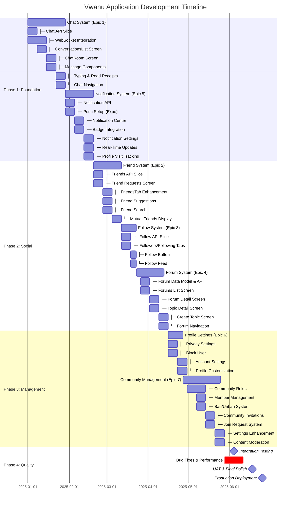
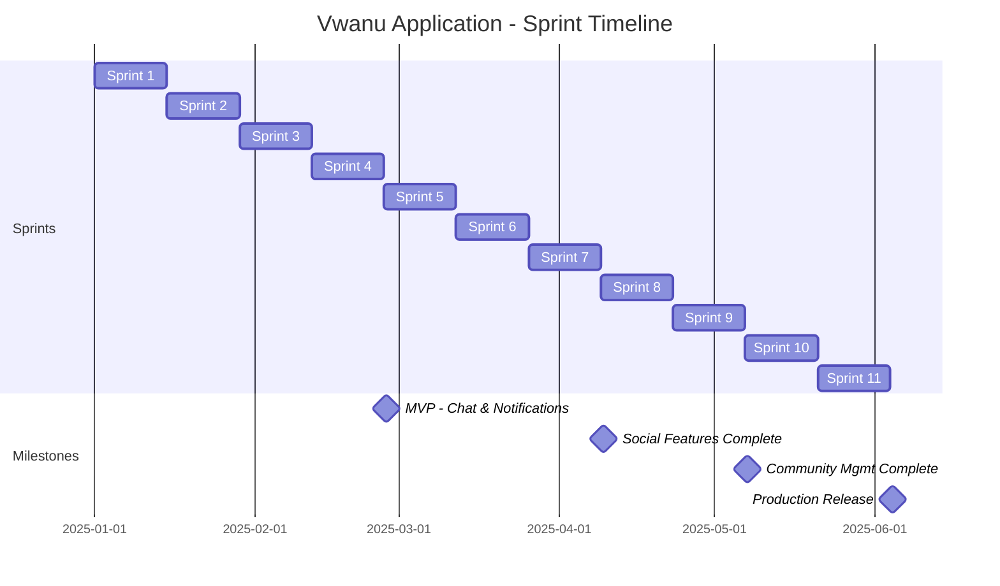
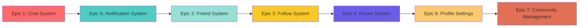
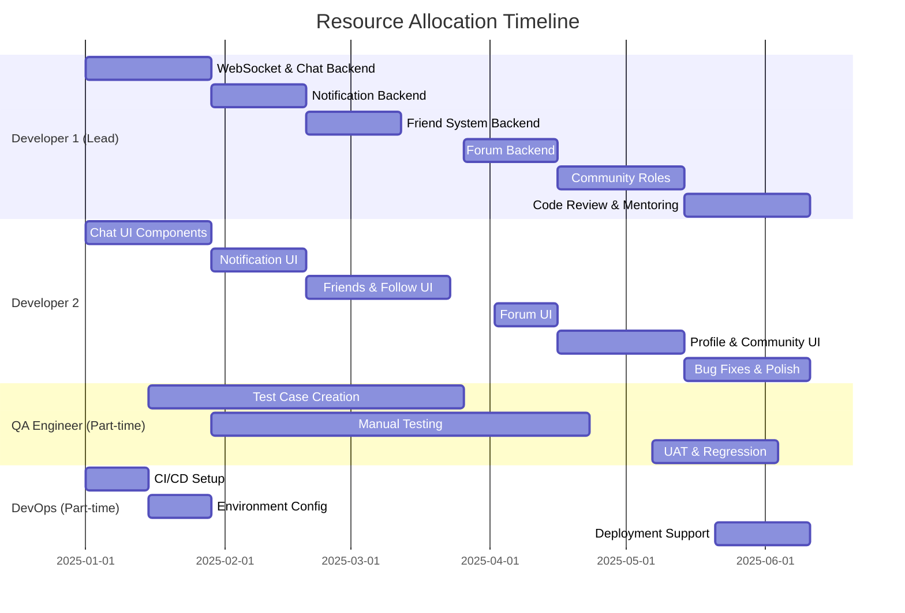
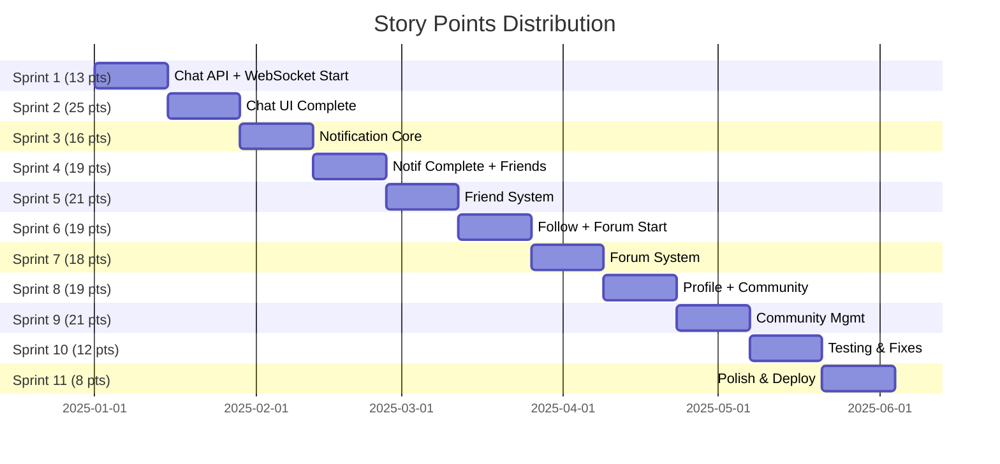
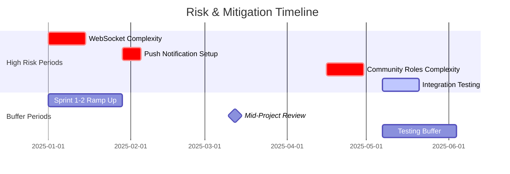

# Vwanu Application - Project Gantt Chart

## Overview

This Gantt chart visualizes the 22-week development timeline for the Vwanu application, showing all 7 epics, their dependencies, and sprint allocations.

## Gantt Chart (Mermaid Syntax)



## Sprint-Based Gantt Chart



## Epic Dependencies Diagram



## Critical Path Analysis

### Critical Path (Longest Dependency Chain)
**Total Duration: 18.5 weeks**

1. **Chat System** (4 weeks) → Epic 1
2. **Notification System** (3 weeks) → Epic 5
3. **Friend System** (3 weeks) → Epic 2
4. **Follow System** (1.5 weeks) → Epic 3
5. **Forum System** (3 weeks) → Epic 4
6. **Profile Settings** (1.5 weeks) → Epic 6
7. **Community Management** (4 weeks) → Epic 7

### Parallel Work Opportunities

Some features can be developed in parallel to reduce timeline:

- **Profile Settings (Epic 6)** can start in Sprint 8 alongside Community Roles
- **Testing activities** can occur throughout development, not just at the end
- **Documentation** can be written alongside feature development

## Resource Allocation Gantt



## Timeline Visualization by Story Points



## Risk Timeline



## Key Dates & Milestones

| Date | Event | Deliverable |
|------|-------|-------------|
| **2025-01-01** | Project Kickoff | Development begins |
| **2025-01-15** | Sprint 1 Complete | WebSocket infrastructure |
| **2025-02-26** | **Milestone 1: MVP** | Chat + Notifications working |
| **2025-03-12** | Mid-Project Review | Assess progress, adjust timeline |
| **2025-04-09** | **Milestone 2: Social Features** | Friends, Follow, Forums complete |
| **2025-05-07** | **Milestone 3: Community Mgmt** | All features code-complete |
| **2025-05-21** | Testing Phase Begins | UAT and regression testing |
| **2025-06-04** | **Milestone 4: Production** | App ready for launch |

## Sprint Velocity Chart

| Sprint | Planned Points | Target Velocity | Notes |
|--------|----------------|-----------------|-------|
| Sprint 1 | 13 | 12-15 | Ramp-up, setup |
| Sprint 2 | 25 | 18-22 | Peak productivity |
| Sprint 3 | 16 | 18-22 | Maintaining velocity |
| Sprint 4 | 19 | 18-22 | On track |
| Sprint 5 | 21 | 18-22 | Peak performance |
| Sprint 6 | 19 | 18-22 | Stable |
| Sprint 7 | 18 | 18-22 | Stable |
| Sprint 8 | 19 | 18-22 | Complex features |
| Sprint 9 | 21 | 18-22 | Peak performance |
| Sprint 10 | 12 | 15-18 | Testing focus |
| Sprint 11 | 8 | 15-18 | Polish and deploy |
| **Total** | **191** | **Average: 17.4** | - |

## Parallel Development Opportunities

To optimize the timeline, certain features can be developed in parallel:

### Weeks 1-4 (Sprints 1-2)
- **Developer 1:** WebSocket backend + Chat API
- **Developer 2:** Chat UI components

### Weeks 5-8 (Sprints 3-4)
- **Developer 1:** Notification backend + Friend API
- **Developer 2:** Notification UI + Friend UI

### Weeks 15-16 (Sprint 8)
- **Developer 1:** Community Roles backend
- **Developer 2:** Profile Settings UI (independent)

## Burndown Chart (Estimated)

```
Story Points Remaining
    |
163 |●
    |  ●
150 |    ●
    |      ●
125 |        ●
    |          ●
100 |            ●
    |              ●
75  |                ●
    |                  ●
50  |                    ●
    |                      ●
25  |                        ●
    |                          ●
0   |                            ●
    +--------------------------------
      S1  S2  S3  S4  S5  S6  S7  S8  S9  S10  S11
      Sprint Number
```

## How to Use This Gantt Chart

1. **View in GitHub:** The Mermaid syntax will render automatically in GitHub markdown viewers
2. **Export to PDF:** Use a Mermaid live editor to export as PNG/PDF
3. **Import to Project Management Tools:** Convert to CSV/JSON for import into Jira, Asana, etc.
4. **Update Progress:** As sprints complete, update the chart to show actual vs. planned timelines

## Recommended Tools

- **Mermaid Live Editor:** https://mermaid.live
- **GitHub Projects:** Native support for Gantt visualization
- **Linear:** Can import issues and create custom views
- **Jira:** For detailed sprint planning and tracking

## Notes

- All dates assume a start date of January 1, 2025
- Adjust dates based on actual project start date
- Sprint lengths are fixed at 2 weeks
- Dependencies must be respected (earlier epics must complete before dependent ones)
- Testing occurs throughout, with dedicated sprints at the end
